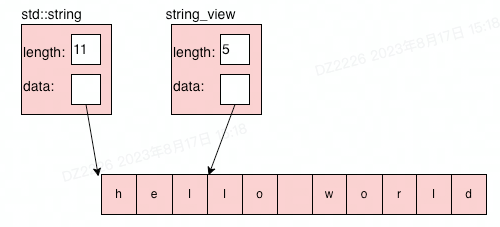

# std::string_view

## 参考
- https://abseil.io/tips/1
- https://www.learncpp.com/cpp-tutorial/introduction-to-stdstring_view/


`std::string_view`是C++ 17中新加入的类。正如其名，它提供了一个字符串的视图，即可以通过这个类以各种方法"观测"字符串，但不允许修改字符串。由于它只读的特性，它并不真正持有这个字符串的拷贝，而是与相对应的字符串共享这一空间，不影响原有字符串的生命周期。即——构造时不发生字符串的复制。同时，你也可以自由的移动这个视图，移动视图并不会移动原定的字符串。

正因这些特性，当你不需要改变字符串时，应当抛弃原来使用的`const std::string&`而采用新的`string_view`，这样可以避免多余的字符串拷贝。

## 引入string_view背景

当创建一个接受（常量）字符串作为参数的函数时
```c++
void TakesString(const std::string& s);
```

当调用者传const char*时，会发生一次拷贝
```c++
TakesString("hello world")
```

但是用string_view不会发生拷贝
```c++
void TakesString(std::string_view s);
```

例
```c++
    const char *c1 = "hello world"; // 0x100bc9e1d
    std::string_view sv_c1 = c1;    // 0x100bc9e1d
    std::string s_c1 = c1;          // 0x7ff7bf3393a1
    cout << "const char *c1: " << c1 << endl;
    cout << "c1 address: " << static_cast<const void *>(c1) << endl;
    cout << "sv_c1 address: " << static_cast<const void *>(sv_c1.data()) << endl;
    cout << "s_c1 address: " << static_cast<const void *>(s_c1.data()) << endl;
```

## string_view内存结构

```c++
    std::string s3 = "hello world";
    std::string_view sv_s3(s3.data() + 3, 5);
```


## string_view生命周期
string_view不影响原来string的生命周期。
超出string的生命周期后，string_view也不能再使用

```c++
std::string_view getView() {
    std::string s = "abcd";
    return std::string_view{s};
}

int mian() {
    auto tmp_sv = getView();
    cout << "getView: " << tmp_sv << endl; // 错误，tmp_sv的原生string已经销毁
}
```

C++中字面量字符串（例"hello world"）是const char *类型
```c++
string s = "hello world";
```
会发生一次拷贝。等价于
```c++
const char *c = "hello world";
string s = c;
```

- Both a C-stype string and a `std::string` will implicitly convert to a `std::string_view`
- `std::string_view` will not implicitly convert to `std::string`

## use `std::string` vs `std::string_view`

### Use a `std::string` variable when:
- You need a string that you can modify.
- You need to store user-inputted text.
- You need to store the return value of a function that returns a `std::string`.

### Use a `std::string_view` variable when:
- You need read-only access to part or all of a string that already exists elsewhere and will not be modified or destroyed before use of the `std::string` is complete.
- You need a symbolic constant for a C-style string.
- You need to continue viewing the return value of a function that return a C-style string or a non-dangling `std::string_view`.

### Use a `std::string` function parameter when:
- The function needs to modify the string passed in as an argument without affecting the caller. This is rare.
- You are using a language standard older than C++17.
- You meet the criteria of the pass-by-reference cases covered in lesson [12.5 -- Pass by lvalue reference](https://www.learncpp.com/cpp-tutorial/pass-by-lvalue-reference/).


### Use a `std::string_view` function parameter when:
- The function needs a read-only string.

### Use a `std::string` return type when:
- The return value is a `std::string` local variable.
- The return value is a function call or operator that returns a `std::string` by value.
- You meet the criteria of the return-by-reference cases covered in less [12.12 -- Return by reference and return by address](https://www.learncpp.com/cpp-tutorial/return-by-reference-and-return-by-address/).

### Use a `std::string_view` return type when:
- The function returns a C-style string literal.
- The function returns a `std::string_view` parameter.

### Things to remember about `std::string`:
- Initializing and copying `std::string` is expensive, so avoid this as much as possible.
- Avoid passing "std::string" by value, as this makes a copy.
- If possible, avoid creating short-lived `std::string` objects.
- Modifying a `std::string` will invalidate any views to that string.

### Things to remember about `std::string_view`:
- Because C-style string literals exist for the entire program, it is always okay to set a `std::string_view` to a C-style string literal.
- When a string is destroyed, all views to that string are invalidated.
- Using an invalidated view will cause undefined behavior.
- `std::string_view` may not be null-terminated.